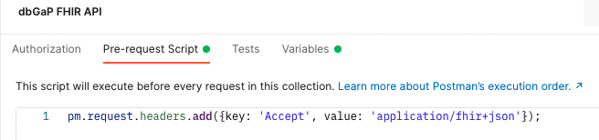
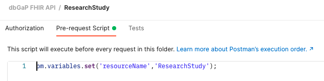
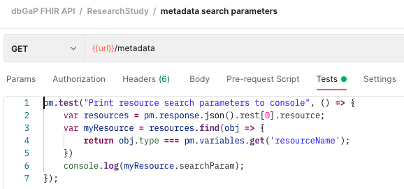
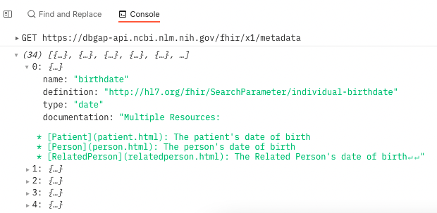

# dbGaP FHIR API Postman Collection Notes

Once you have installed Postman, you will import the collection json file.

## Collection Structure
* Collection: dbGaP FHIR API
    * Folder: FHIR Resource
        * HTTP Requests


## Pre-request Scripts
Postman allows you to run a script before the request is executed. The 
scripts can be defined at each level (collection, folder, request). If the 
script is defined at the collection level, then it will be executed before every request in the collection. If 
it is defined at the folder level, then it will be run only for the requests 
in that folder.  

Since the FHIR API standard requires an http accept header, I have defined a 
script at the collection level to set a header for every request.




## Variables
Postman allows variables to be set at each level (collection, folder,
request). These variables can be used in various places to help with testing
the api.

In order to minimize effort for similar requests for multiple resources, I
have defined two variables:  

#### url
```url``` is defined at the collection level. This is the base url for the API.


#### resourceName
```resourceName``` Is defined at the folder level. (Notice this is 
actually a script that is setting the variable since there is no variables 
tab at the folder level).

  

When the two variables are combined in the request url field (accessed using 
curly braces), a fully formed parameterized url is created.


## Tests
You can define a test script using javascript to execute immediately after a 
request has been executed. You can test for things like response time, 
response code, and response body.  
I created a test that will parse the response body for the metadata 
resource for each resource type to determine their search parameters. The 
search parameters will be displayed in the console.



Patient search parameters:  
