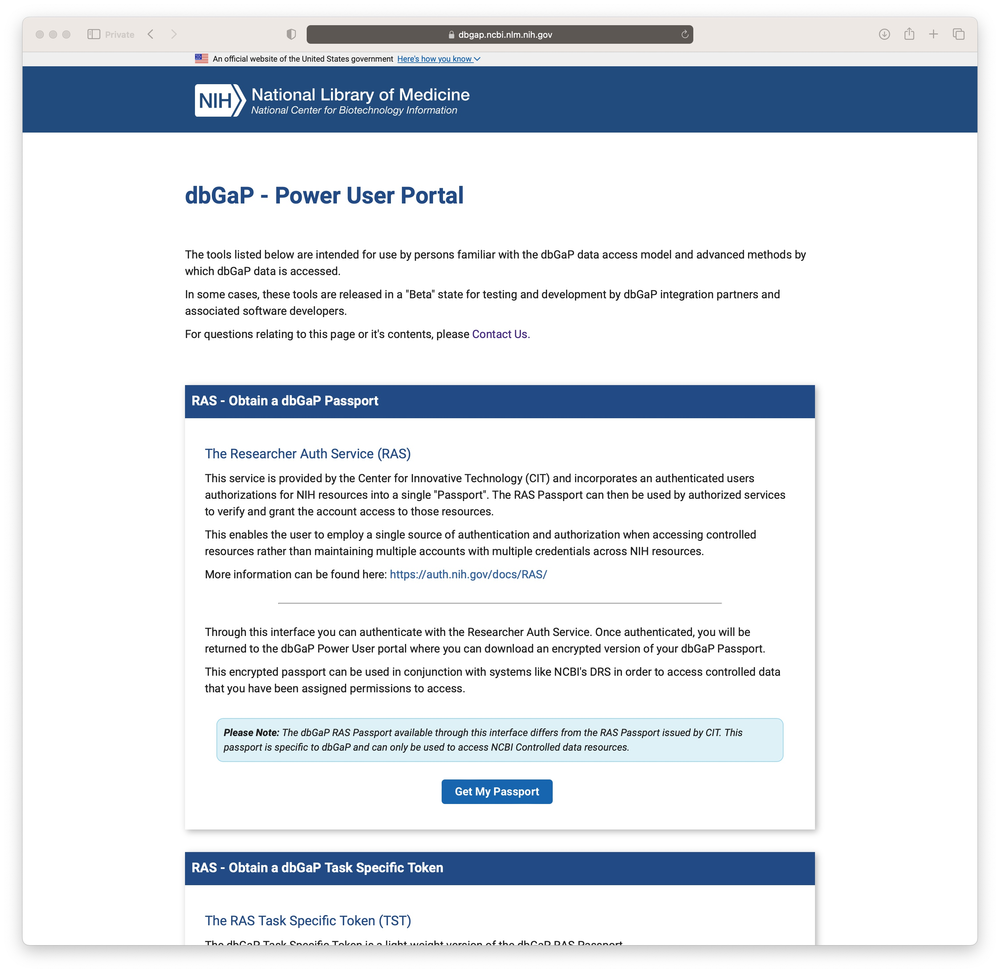
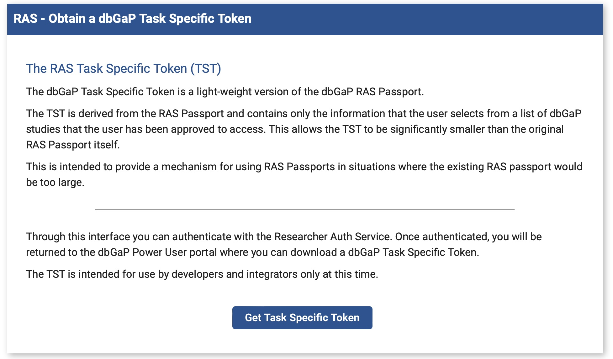
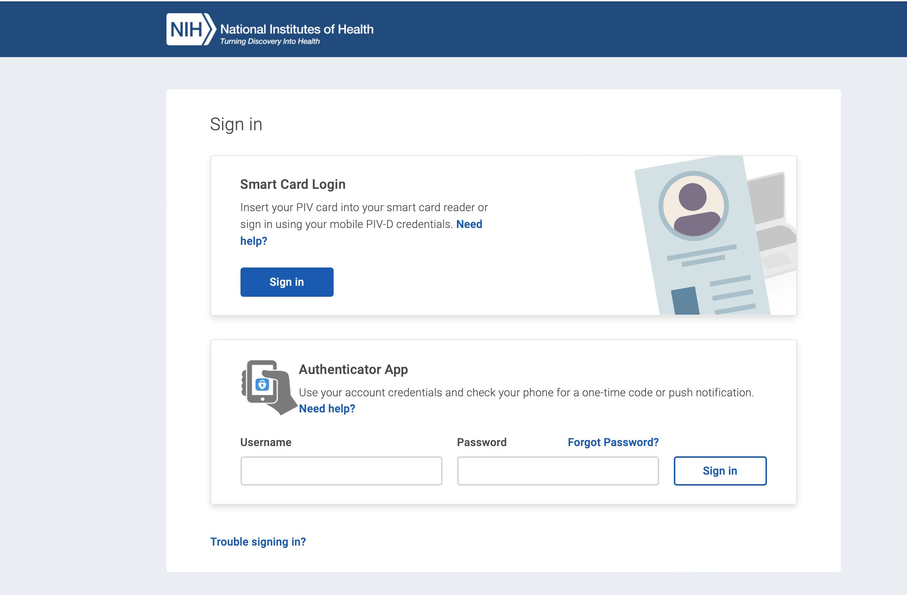
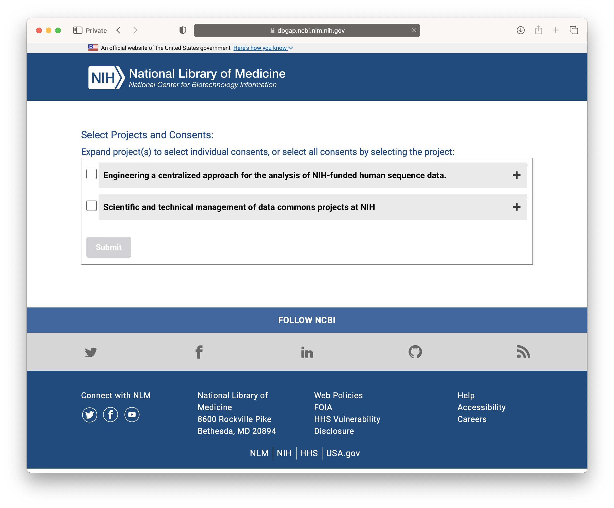
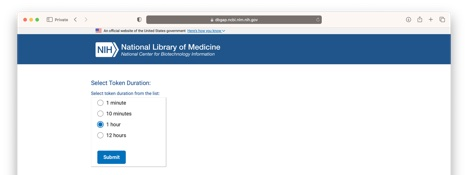
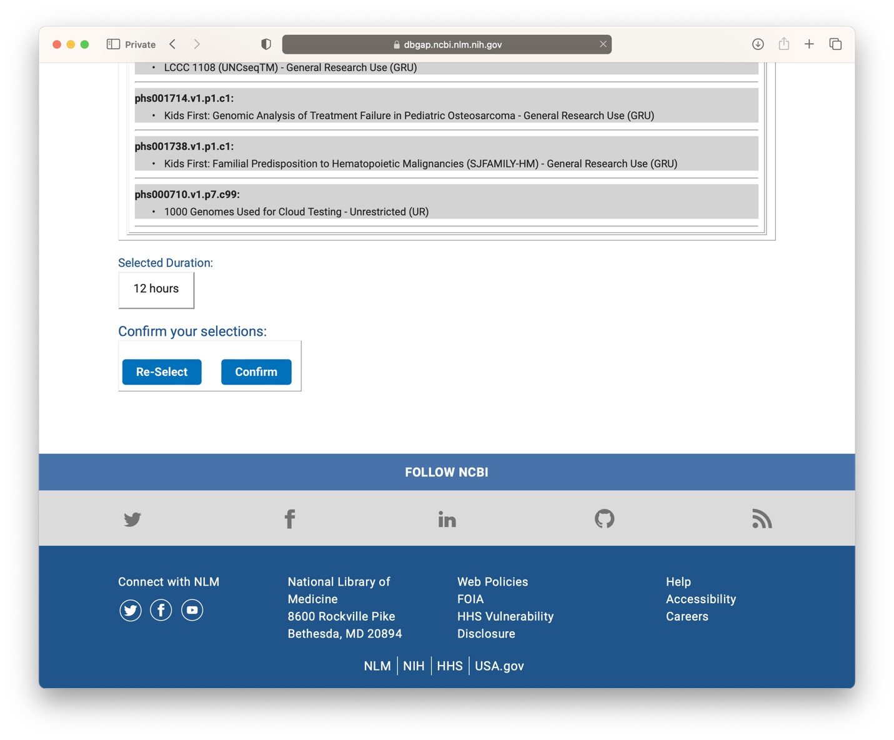
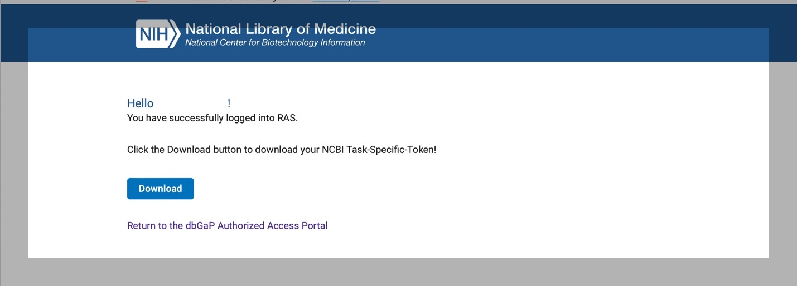

# Obtaining a token to access dbGaP data

The following describes a simple web application to obtain a "passport" or token to access controlled access data via programmatic interfaces (APIs). It requires you to log in to dbGaP and download a file containing a token which can be used in calls to the APIs.

## Note on use of controlled access data

Your access to controlled data is granted under a project previously
submitted by an investigator. You, the user, may be that investigator, or have been designated by that investigator as a 'downloader'. The specific terms of use are described in a Data Use Agreement. Please ensure you are familiar with the terms of use.

## Obtain a token or passport

In a web browser, open the following link to open the Power User Portal

https://dbgap.ncbi.nlm.nih.gov/cda/dbGaPLogin/

You may request a passport or a task specific token. Each may be used as follows:

### Passport

May be used with the NCBI Data Repository Service (DRS1) to access files.

- Click **Get My Passport**.
- Go to **Login** below

### Task Specific Token

May be used with NCBI DRS or FHIR server.

Scroll down to the "RAS - Obtain a dbGaP Task Specific Token"

- Click Get **Task Specific Token** - Go to **Login** below

1DRS is a standard published by the Global Alliance for Genomics and Health (GA4GH).

# Login

Whether you picked Passport or Task Specific Token you will be asked to log in using the appropriate method depending on the organization you work for.

The next steps depend on whether you are obtaining a Passport or TST.

## Passport

After logging in Click **Download** to save the passport to a local file according to how your web browser is set up to handle downloads.

You have now obtained the passport required by the API you wish to use it with.

## Task Specific Token

Select the dbGaP project you wish to work with and download the token as follows.

### Select dbGaP project

The one or more dbGaP projects under which you have been granted access will be listed.

For each project, the investigator will have requested access to certain dbGaP study consent groups2. Click the checkbox next to the project you wish to work with.

2A consent group is a group of subjects within a study who consented to use of their data under particular terms.

#### Single project displayed

For most users only one project will be displayed. In this case you may simply select the project and click **Submit**.

Note: the individual study consent groups within the project will be displayed, and all are pre-selected. It is currently possible to select only specific study consent groups - but this is generally unnecessary. We will remove this feature in the future to simplify the interface.

#### Multiple projects displayed

In the case where more than one project is available the following apply:

It is possible to make selections of consent groups from more than one project. In general, you should avoid this. Access to studies was granted according to the purposes of the submitted project. Combining data from studies across projects may be outside the terms under which access was granted.

 

Scroll down and select **Submit**.

### Select token duration

Choose how long you would like the token to be valid, and click **Submit**.

### Confirm details

Click **Confirm** if you are happy with the selections made.

You may click **Re-Select** to return to the project selection page

### Download

Click **Download** to save the token to a local file. Ensure only you can access the file.

Use the downloaded token with the API you wish to use. Consult the API documentation for how to include the token in your request to the API.

---
