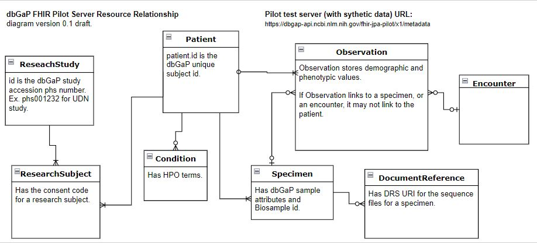

# What resources does the dbGaP FHIR pilot server have?

**Note:**
1. Each resource in column-ResourceType links to HL7 official resource page for quick reference. For example, Patient goes to URL: [https://hl7.org/fhir/patient.html](https://hl7.org/fhir/patient.html)
2. The FHIR resources chosen to represent dbGaP dataset in our pilot server are the results of initial exploration. We greatly welcome your feedback. We are committed to work with our users and the NCPI FHIR community(https://nih-ncpi.github.io/ncpi-fhir-ig/) to improve how we deliver dbGaP data on FHIR API.

## dbGaP FHIR Pilot Server Resource List
    
| **ResourceType** | **Example URL** | **dbGaP FHIR Implementation Comments** |
|------------------|-----------------|----------------------------------------|
| [**ResearchStudy**](https://hl7.org/fhir/researchstudy.html) | [https://dbgap-api.ncbi.nlm.nih.gov/fhir-jpa-pilot/x1/ResearchStudy?_id=phs001232](https://dbgap-api.ncbi.nlm.nih.gov/fhir-jpa-pilot/x1/ResearchStudy?_id=phs001232) | This will contain information for public study meta data which is shown on the dbGaP study page. For example: [https://www.ncbi.nlm.nih.gov/projects/gap/cgi-bin/study.cgi?study_id=phs001232.v5.p2](https://www.ncbi.nlm.nih.gov/projects/gap/cgi-bin/study.cgi?study_id=phs001232.v5.p2). FHIR URL example: |
| [**Patient**](https://hl7.org/fhir/patient.html) | [https://dbgap-api.ncbi.nlm.nih.gov/fhir-jpa-pilot/x1/Patient?_id=2753785](https://dbgap-api.ncbi.nlm.nih.gov/fhir-jpa-pilot/x1/Patient?_id=2753785) | - Only two fields are populated: id and gender. Patient id is the dbGaP_subject_id, the dbGaP-wide unique integer for each individual. - One dbGaP_subject_id may be in multiple studies. - One dbGaP_subject_id can map to many submitted_subject_id. Based on what is submitted to dbGaP and what dbGaP can analyze, there exist multiple dbGaP_subject_ids which are the same individual. - For more details on dbGaP_subject, see: [https://www.ncbi.nlm.nih.gov/gap/docs/submissionguide/#4-what-is-a-dbgap-subject](https://www.ncbi.nlm.nih.gov/gap/docs/submissionguide/#4-what-is-a-dbgap-subject) |
| [**ResearchSubject**](https://hl7.org/fhir/researchsubject.html) | [https://dbgap-api.ncbi.nlm.nih.gov/fhir-jpa-pilot/x1/ResearchSubject?study=phs001232&patient=2753785](https://dbgap-api.ncbi.nlm.nih.gov/fhir-jpa-pilot/x1/ResearchSubject?study=phs001232&patient=2753785) | - This resource has the subject consent within the study. - ResearchSubject.id format is study-phs-number and patient.id. Example: phs001232-2753785. - If a person is enrolled in two studies, they will have two ResearchSubject entries, possibly with different consent. - Links to ResearchStudy and Patient |
| [**Specimen**](https://hl7.org/fhir/specimen.html) | [https://dbgap-api.ncbi.nlm.nih.gov/fhir-jpa-pilot/x1/Specimen?subject=Patient/2753785](https://dbgap-api.ncbi.nlm.nih.gov/fhir-jpa-pilot/x1/Specimen?subject=Patient/2753785) | - Specimen id is constructed with prefix dgs and the dbGaP sample_id, which is always a number. - dbGaP creates this dbGaP-wide unique identifier for each submitted_sample_id. - submitted_sample_id is alphanumeric and is only unique within each study. - Multiple dbGaP_sample_id may map to the same dbGaP_subject_id. - dbGaP also has pooled samples, a sample pointing to multiple research subjects. This is not addressed in Specimen resource modeling yet. |
| [**Observation**](https://hl7.org/fhir/observation.html) | [https://dbgap-api.ncbi.nlm.nih.gov/fhir-jpa-pilot/x1/Observation?subject=Patient/2753785](https://dbgap-api.ncbi.nlm.nih.gov/fhir-jpa-pilot/x1/Observation?subject=Patient/2753785) | Observation data is for dbGaP "Subject phenotype" dataset. Using UDN as an example, on UDN study page ([https://www.ncbi.nlm.nih.gov/projects/gap/cgi-bin/study.cgi?study_id=phs001232.v5.p2](https://www.ncbi.nlm.nih.gov/projects/gap/cgi-bin/study.cgi?study_id=phs001232.v5.p2)), click on "Phenotype Datasets", "List all datasets within this study", "UDN_Subject_Phenotypes", you see this dataset page ([https://www.ncbi.nlm.nih.gov/projects/gap/cgi-bin/dataset.cgi?study_id=phs001232.v5.p2&pht=6079](https://www.ncbi.nlm.nih.gov/projects/gap/cgi-bin/dataset.cgi?study_id=phs001232.v5.p2&pht=6079)). This page shows that the UDN study's subject phenotype dataset includes "SEX, RACE, ETHNICITY, PRIMARY_SYMPTOM_CATEGORY, AGE_ONSET and AFFECTION_STATUS" for each subject. |
| [**Condition**](https://hl7.org/fhir/condition.html) | [https://dbgap-api.ncbi.nlm.nih.gov/fhir-jpa-pilot/x1/Condition?subject=Patient/3510690](https://dbgap-api.ncbi.nlm.nih.gov/fhir-jpa-pilot/x1/Condition?subject=Patient/3510690) | 1. UDN study includes a dataset "UDN_phenotype_code" as you can see from "Phenotype Datasets" -> "List all datasets within this study": [https://www.ncbi.nlm.nih.gov/projects/gap/cgi-bin/dataset.cgi?study_id=phs001232.v5.p2&pht=6078](https://www.ncbi.nlm.nih.gov/projects/gap/cgi-bin/dataset.cgi?study_id=phs001232.v5.p2&pht=6078). Subjects' HPO term and "Whether or not phenotype was observed in the patient" is in Condition. 2. Note Condition.id format is (patient.id-UDN HPO phv variable id-HPO code). This is the UDN HPO phv variable id page: [https://www.ncbi.nlm.nih.gov/projects/gap/cgi-bin/variable.cgi?study_id=phs001232.v5.p2&phv=278114&phd=&pha=&pht=6078&phvf=&phdf=&phaf=&phtf=&dssp=1&consent=&temp=1](https://www.ncbi.nlm.nih.gov/projects/gap/cgi-bin/variable.cgi?study_id=phs001232.v5.p2&phv=278114&phd=&pha=&pht=6078&phvf=&phdf=&phaf=&phtf=&dssp=1&consent=&temp=1) |
| [**Group**](https://hl7.org/fhir/group.html) | Get the group which has Patient/3510690: [https://dbgap-api.ncbi.nlm.nih.gov/fhir-jpa-pilot/x1/Group?member=Patient/3510690](https://dbgap-api.ncbi.nlm.nih.gov/fhir-jpa-pilot/x1/Group?member=Patient/3510690) | 1. dbGaP currently uses Group to model the "family" in a pedigree. 2. Group.id has a prefix "fam-" followed by the submitted family_id. Ex. fam-da4b5d37-2b37-11eb-8d6f-0af3c4a4ae48 |
| [**FamilyMemberHistory**](https://hl7.org/fhir/familymemberhistory.html) | To get the mother/father of a patient: [https://dbgap-api.ncbi.nlm.nih.gov/fhir-jpa-pilot/x1/FamilyMemberHistory?patient=Patient/3510690](https://dbgap-api.ncbi.nlm.nih.gov/fhir-jpa-pilot/x1/FamilyMemberHistory?patient=Patient/3510690) | 1. dbGaP currently uses FamilyMemberHistory to model the pedigree relationship. 2. FamilyMemberHistory.id format is `patient.id-mother.id` or `patient.id-father.id`. |
| [**DocumentReference**](https://hl7.org/fhir/documentreference.html) | [https://dbgap-api.ncbi.nlm.nih.gov/fhir-jpa-pilot/x1/DocumentReference?subject=Patient/3510927](https://dbgap-api.ncbi.nlm.nih.gov/fhir-jpa-pilot/x1/DocumentReference?subject=Patient/3510927) | 1. A document links to a patient via the Specimen id. A patient (dbGaP-subject-id) can have more than one specimen (sample in dbGaP) in a study. Each specimen links to 1 or more documents. 2. In a separate notebook, we will show how you can use the DRS URI to download the document. |
